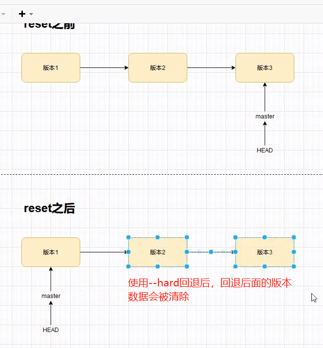
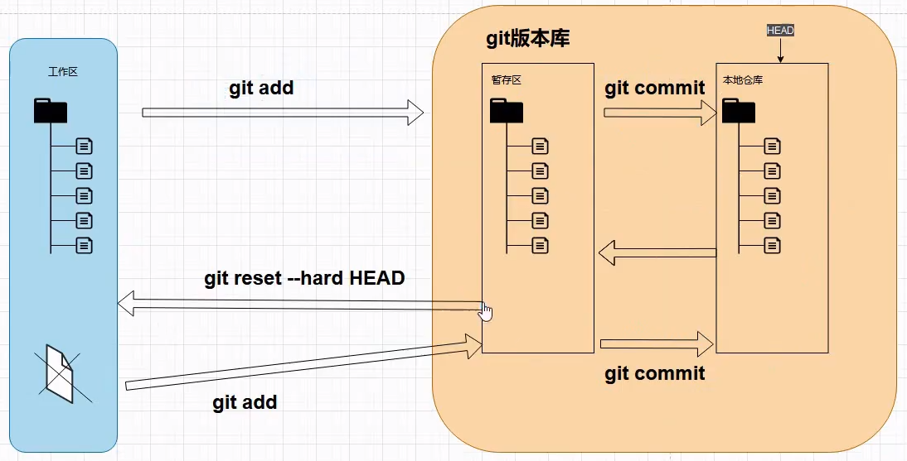
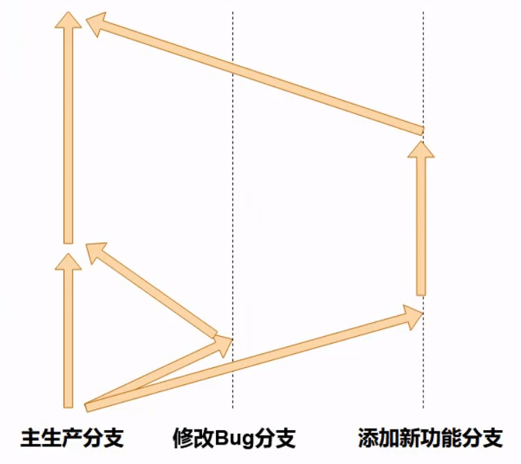
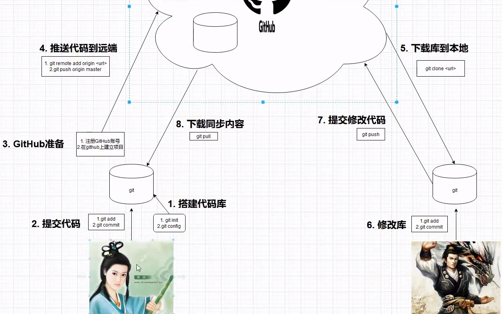

一、git是什么？
1、关于git：git是目前世界上最先进的分布式版本控制工具（没有之一）。
2、什么是版本控制工具？就是帮助我们管理不同版本文件的应用程序。


二、git诞生历史
1、2002年之前，linus自己手动维护linus的版本代码；
2、2002年-2005年，使用免费的bitkeeper
3、2005年之后，因为linus社区人员恶意破解bitkeeper，导致bitkeeper收回linus的使用权，迫使linus开发git。


三、集中式版本控制工具和分布式版本控制工具的区别
1、集中式版本控制工具
```js
    如：svn、cvs、vss

    特点：
    1）实现大部分开发中对版本管理的需求；
    2）结构很简单，上手容易。

    缺点：
    1）对中央仓库依赖很严重，一旦中央仓库被损坏了，历史数据怎么恢复？
    2）程序员上传的代码都是完整版，如何追溯历史代码查询？
    3）系统正在上线运行，需要修改bug或添加新功能，时间持续几个月，如何同时管理几个版本？
    4）如何管理一个分布在世界上各地且互不认识的大型开发团队的代码。
```


四、git的作用
1、多人协同开发
2、版本记录
3、冲突解决
4、追溯历史
5、代码备份
6、版本还原
7、权限管理
8、分支管理
9、代码审查


五、git的安装
1、历史：因为git是在linux上开发的，所以很长一段时间，git只能在linux和unix上运行。后来有人把它移植到了windows平台上，在windows平台上也就可以用了，现在git可以在linux、unix、mac、os和windows几个主流平台运行。

2、在windows中安装git：
```js
    1）命令行工具：git for windows。网址：https://git-for-windows.github.io 。（点击安装包的next，就可以傻瓜式的安装）

    2）idea插件

    3）github网站：https://github.com/

    4）可视化工具：TortoiseGit，网址：https://tortoisegit.org
```

3、配置git签名
```js
    1）启动git bash：选中要作为git工程存放的目录，然后点击鼠标右键选择git bash即可。

    2）git是分布式版本控制工具，所以我们需要填写用户名和邮箱作为一个标志。在 c:\user\lixi19861125 路径下的.gitconfig文件里面，可以看到--global属性，所有的git项目都会公用这个属性。（下面是配置--global的用户名和用户邮箱）
    用户名：git config --global user.name "lili"
    用户邮箱：git config --global user.email "lixi@1000phone.com"
```


六、创建git版本库
1、选中一个git工程目录（就是项目目录）
2、输入以下命令初始化版本库，初始化之后会生成一个.git文件夹，该文件夹用来存放所有历史版本数据。
```js
    git init
```


七、git常见命令操作
```js
    // 1、查看文件状态。
    git status

    // 2、将文件或目录添加到临时暂存区（添加到暂存区的文件或目录才可被跟踪）
    git add 文件名/目录名/.（“.”表示提交所有文件）

    // 3、将文件或目录从临时暂存区移除。
    git rm --cached 文件名/目录名/.

    // 4、提交所有暂存区文件（每当有文件被修改/添加/删除的时候，都需要重新git add，然后再git commit）
    大段文字编写模式：git commit
    提交简约描述：git commit -m 提交描述

    // 5、将暂存区的文件从暂存区撤出。
    git restore --staged 文件名

    // 6、还原文件。如果在工作区修改了文件内容，但还没提交到暂存区和本地版本库，执行了git checkout之后会把工作区的修改内容清除掉，并且还原至上一次git commit提交的内容。注意：git checkout还原文件后不会清除数据，这点跟git reset --Hard不一样。
    git checkout 文件名

    // 7、丢弃工作区文件的修改，作用跟还原文件的作用类似。
    git restore 文件名

    // 8、查看历史提交日志。
    详细模式：git log   // 详细模式会把commit_id、Author、Date、commit_description打印出来
    简约模式：git log --pretty=oneline   // 简约模式仅打印commit_id和commit_description

    // 9、回退版本。
    // git reset表示修改HEAD的位置，HEAD是git中的一个指针，永远指向最新版本，^1表示让HEAD指针指向上一个版本。
    // --hard（硬）：回退版本，会将指定的数据抹除，不会保留任何你修改的记录
    // --soft（软）：回退版本，会保留改动的记录，会自动帮你git add。
    // --mix（中）：回退版本，会保留所有改动记录，单不会自动帮你git add。
    回退一个版本：git reset --hard HEAD^1
    回退多个版本：git reset --hard HEAD~2
    注意：git reset --hard这种回退方式会把回退到当前版本后面的版本数据清除。
    
    // 10、删除文件，需要在本地删除文件，然后git add和git commit提交删除文件后的新版本。但是这种删除不是真的删除，在.git文件管理的历史版本（通过git reflog查看）中依然保存着被删除的文件，此时如果需要回复，可以使用git reset恢复。
    git add .
    git commit -m "message"
    // 如果需要恢复被删除的文件，则：
    git reset --hard 版本id号
```

扩展：
```js
    // 1、查看文件目录。
    ll

    // 2、修改文件。
    vi 文件名

    // 3、保存修改后的文件。
    先按Esc退出编辑，然后按Shift+";"，再输入q!（不保存改动）或wq!（保存改动）
```


八、工作区、暂存区、本地库
1、工作区（Working Directory）：Project在你电脑的本地磁盘目录。

2、暂存区（stage）：一般指的是.git目录下的index文件，在编辑project，并使用git add后，新的项目版本会被存储在git目录下的index文件中，所以有时我们也把暂存区称为索引。

3、本地库（Repostory）：工作区根目录有一个隐藏目录.git文件夹，这就是git的本地版本库。



九、分支
1、分支的概念：当项目上线了，产品经理提出新的需求或要修复新Bug时，我们要在完成需求或改Bug的同时保持项目的上线运行，此时就需要用到分支管理了。（各分支的关系和作用如下图所示）

1）主分支负责项目运行，在上线运行前，会先clone一份添加新需求的分支和修复Bug的分支；
2）Bug分支，当发现Bug时，先在此分支修复Bug，待修复完成之后，再将Bug分支的内容合并到主分支；
3）新需求分支，当有新需求的时候，在此分支进行开发，开发完成之后，再将新需求分支的内容合并到主分支。

2、操作分支的相关命令：
```js
    // 1）查看分支。查看简略信息，则只显示当前所在分支和分支名；查看详细信息，则显示当前所在分支、分支名、分支ID、分支更新消息。
    查看简略信息：git branch
    查看详细信息：git branch -v

    // 2）创建分支
    git branch 分支名

    // 3）切换分支
    git checkout 分支名

    // 4）合并分支
    // 先切换到主分支
    git checkout master
    // 再合并分支
    git merge 分支名

    // 5）删除分支
    git branch -d 分支名
```

3、分支冲突
1）冲突一般是指两种版本的仓库合并时，相同文件同一位置的代码不一致而导致版本管理工具无法判断保留哪一版本而出现的提示。冲突一般需要程序员手动解决

2）在合并分支时解决冲突
```js
    // 2.1）先在master、common分支各创建一个conflict.txt文件，并让里面的内容不一致，然后提交合并。

    // 2.2）当出现冲突提示的时候，根据提示的位置去协商修改里面的内容为相同部分即可。
```


十、github
本地代码和远端的相关操作
```js
    // 连接远端的github仓库，origin指得是远端代号，一半远端代号都是这个，但也可以自定义。
    git remote add origin url地址

    // 推送本地版本库代码到远端。-u参数是可选的，添加了参数-u之后，后面可以直接使用 git push 代替 git push origin 分支名。
    git push -u origin 分支名

    // 克隆远端仓库代码到本地。项目的目录名指为克隆的项目在本地新建一个目录名，选填项，如果不填默认就是使用github的仓库名。
    git clone url地址 项目的目录名
 
    // 拉取远端仓库代码到本地
    git pull origin 分支名
```



十一、协作冲突